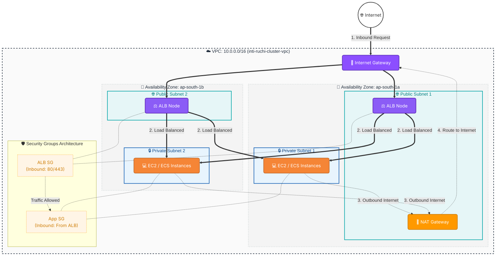

# AWS VPC Terraform Project

This repository contains a production-ready Terraform setup to provision a scalable, highly available Virtual Private Cloud (VPC) network in AWS. It follows infrastructure-as-code best practices, featuring modular design, consistent tagging, and CI/CD integration.

## 🌟 Architecture Overview

This project sets up the following resources in the `ap-south-1` region:

- **VPC** with CIDR `10.0.0.0/16` (`inti-ruchi-cluster-vpc`).
- **2 Public Subnets** across two different Availability Zones (with auto-assigned public IP enabled).
- **2 Private Subnets** across two different Availability Zones.
- **Internet Gateway (IGW)** for public internet access.
- **NAT Gateway (with Elastic IP)** allowing private subnets to securely access the internet.
- **Public Route Table** connected to the IGW.
- **Private Route Table** connected to the NAT Gateway.
- **Consistent Tagging** across all resources (Name, Environment, Project).

### 🖼️ Architecture Diagram



## 🚀 Getting Started Locally

### Prerequisites
1. [Terraform CLI](https://developer.hashicorp.com/terraform/downloads) installed (v1.0.0+).
2. [AWS CLI](https://docs.aws.amazon.com/cli/latest/userguide/getting-started-install.html) installed.

### 🔐 1. IAM Setup for Terraform Execution

Terraform needs an AWS IAM user with programmatic access to manage resources.

1. Go to the AWS Management Console -> **IAM** -> **Users**.
2. Click **Create user**. Give it a name like `terraform-admin`.
3. Check **Provide user access to the AWS Management Console** (optional, but good for learning), or just proceed to the next step for programmatic access only.
4. On the **Set permissions** page, select **Attach policies directly**.
5. Search for and check **AdministratorAccess** (Note: this is great for learning/portfolio projects. For strict production, use least-privilege policies).
6. Complete user creation.
7. Click on the user `terraform-admin` -> **Security credentials** tab.
8. Scroll down to **Access keys** and click **Create access key**. Select **Command Line Interface (CLI)**.
9. Safely copy the **Access key ID** and **Secret access key**.

### 💻 2. Configure AWS CLI

Open your terminal and configure the AWS CLI with the credentials you just generated:

```bash
aws configure
```

It will prompt you for:
- **AWS Access Key ID**: Paste the Access key ID.
- **AWS Secret Access Key**: Paste the Secret access key.
- **Default region name**: `ap-south-1`
- **Default output format**: `json`

### 🛠️ 3. Code Quality Checks

Before initializing and deploying, ensure your code is formatted and valid. This is crucial for maintaining a clean, readable, and error-free codebase in production environments:

```bash
# Automatically formats Terraform code to standard canonical style
terraform fmt

# Validates syntax, arguments, and internal consistency of the configuration
terraform validate
```

### 🏗️ 4. Deploy Infrastructure

Run the following Terraform commands to provision the network:

```bash
# Initialize the Terraform working directory
terraform init

# Review the execution plan to see what resources will be created
terraform plan

# Apply the changes to create the infrastructure
terraform apply
```

To destroy the infrastructure when you're done testing:
```bash
terraform destroy
```

## 💸 Cost Warning

* **Important:** This infrastructure includes a **NAT Gateway**, which incurs an hourly cost while running, as well as per-GB data processing fees.
* To avoid unexpected charges on your AWS account, always remember to run `terraform destroy` immediately after you are finished testing or demonstrating this project.

## ⚠️ Design Considerations

* **Cost Optimization vs. High Availability**: A single NAT Gateway is used in this setup to optimize costs, which means it is not highly available and introduces a single point of failure. (Check the `main.tf` file for commented-out code to enable a fully Highly Available multi-NAT setup).
* **Availability Zones**: Subnets are distributed evenly across multiple Availability Zones to provide redundancy.
* **Infrastructure as Code**: The entire infrastructure is managed strictly using Terraform to ensure reproducibility and immutability.

## 🤖 GitHub Actions (CI/CD)

This project includes a fully automated CI/CD pipeline defined in `.github/workflows/terraform.yml`.

### Workflow Behavior
- **On Pull Request**: Runs `terraform init`, `fmt`, `validate`, and `plan` to verify changes.
- **On Push to Main**: Runs all the above, plus `terraform apply` to automatically deploy the changes to AWS.

### Setting up Secrets for GitHub Actions
For the workflow to authenticate with AWS securely, you must store your AWS credentials in GitHub Secrets.

1. Go to your repository on GitHub.
2. Click **Settings** -> **Secrets and variables** -> **Actions**.
3. Click **New repository secret**.
4. Add the following secrets:
   - `AWS_ACCESS_KEY_ID`: Your IAM User Access Key ID.
   - `AWS_SECRET_ACCESS_KEY`: Your IAM User Secret Access Key.

> **Note**: Never commit your AWS credentials in source code. The `.tfvars` file is safe to commit as it only contains non-sensitive variables, but state files and credentials should be ignored or securely managed.
